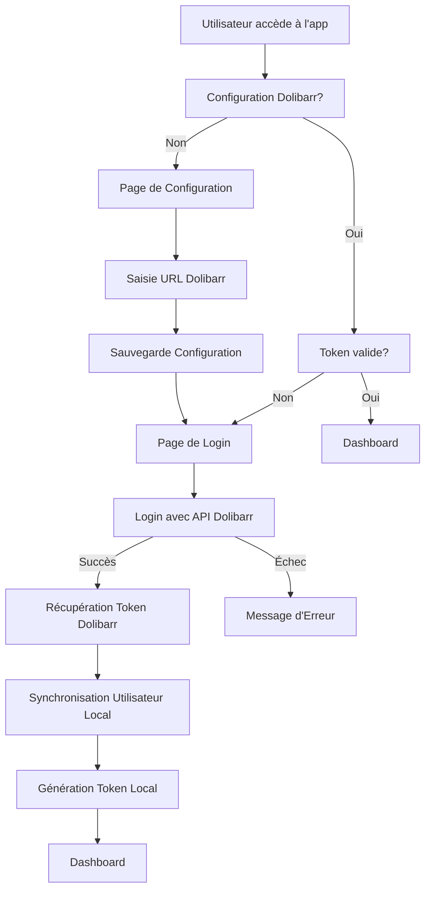

# Système d'Authentification NewDoli avec API Dolibarr

## 🔐 Architecture d'Authentification

NewDoli utilise maintenant l'API Dolibarr pour l'authentification avec un système de token et d'interceptor HTTP.

### 📋 Composants Principaux

1. **DolibarrApiService** - Service pour communiquer avec l'API Dolibarr
2. **AuthInterceptor** - Interceptor HTTP pour injecter automatiquement le token
3. **AuthService** - Service d'authentification mis à jour
4. **SyncService** - Service de synchronisation des données

### 🔄 Flux d'Authentification



### 🛠️ Fonctionnalités Implémentées

#### 1. **Authentification API Dolibarr**
- Login via API Dolibarr (`/api/index.php/login`)
- Récupération du token d'authentification
- Validation du token au démarrage
- Logout via API Dolibarr

#### 2. **Interceptor HTTP**
- Injection automatique du token dans les requêtes API
- Détection des erreurs 401/403
- Redirection automatique vers login si token invalide
- Exclusion des requêtes non-API

#### 3. **Gestion des Tokens**
- **Token Dolibarr** : Stocké dans la configuration Dexie
- **Token Local** : Gestion de session locale
- Validation automatique du token au démarrage
- Nettoyage automatique en cas d'erreur

#### 4. **Synchronisation des Données**
- Synchronisation des utilisateurs depuis Dolibarr
- Synchronisation des groupes et permissions
- Synchronisation des tiers
- Gestion des erreurs de synchronisation

### 🔧 Configuration Requise

#### 1. **URL Dolibarr**
```typescript
// Configuration stockée dans Dexie
{
  key: "dolibarr_url",
  value: "https://your-dolibarr-server.com/",
  type: "string"
}
```

#### 2. **Token d'Authentification**
```typescript
// Token stocké dans Dexie
{
  key: "dolibarr_token",
  value: "eyJ0eXAiOiJKV1QiLCJhbGciOiJIUzI1NiJ9...",
  type: "string"
}
```

### 📡 Endpoints API Dolibarr

#### **Login**
```http
POST /api/index.php/login
Content-Type: application/json

{
  "login": "username",
  "password": "password"
}
```

#### **User Info**
```http
GET /api/index.php/users/me
Authorization: Bearer {token}
```

#### **Validate Token**
```http
GET /api/index.php/users/me
Authorization: Bearer {token}
```

#### **Logout**
```http
POST /api/index.php/logout
Authorization: Bearer {token}
```

### 🔒 Sécurité

1. **Validation du Token** : Vérification automatique au démarrage
2. **Interceptor HTTP** : Injection sécurisée du token
3. **Gestion des Erreurs** : Redirection automatique si token invalide
4. **Nettoyage** : Suppression automatique des tokens invalides

### 🚀 Utilisation

#### **Login**
```typescript
const credentials = { login: 'username', password: 'password' };
this.authService.login(credentials).then(observable => {
  observable.subscribe({
    next: (success) => {
      if (success) {
        // Redirection vers dashboard
      }
    },
    error: (error) => {
      // Gestion des erreurs
    }
  });
});
```

#### **Logout**
```typescript
await this.authService.logout();
// Token supprimé automatiquement
// Redirection vers login
```

#### **Vérification d'Authentification**
```typescript
if (this.authService.isAuthenticated()) {
  // Utilisateur connecté
}
```

### 🔄 Synchronisation

#### **Synchronisation Manuelle**
```typescript
this.syncService.syncAllData().subscribe({
  next: (results) => {
    console.log('Synchronisation terminée:', results);
  },
  error: (error) => {
    console.error('Erreur de synchronisation:', error);
  }
});
```

#### **Test de Connexion**
```typescript
this.syncService.testConnection().subscribe({
  next: (connected) => {
    if (connected) {
      console.log('Connexion API OK');
    }
  }
});
```

### ⚠️ Gestion des Erreurs

1. **Token Invalide** : Redirection automatique vers login
2. **API Indisponible** : Message d'erreur utilisateur
3. **Erreur de Synchronisation** : Log des erreurs, continuation du processus
4. **Configuration Manquante** : Redirection vers page de configuration

### 🎯 Avantages

- ✅ **Authentification Centralisée** : Via l'API Dolibarr
- ✅ **Sécurité Renforcée** : Tokens JWT de Dolibarr
- ✅ **Synchronisation Automatique** : Données toujours à jour
- ✅ **Gestion d'Erreurs** : Redirection automatique si problème
- ✅ **Performance** : Cache local avec synchronisation
- ✅ **Offline-First** : Fonctionne même hors ligne

### 🔧 Configuration Avancée

#### **Personnalisation des Endpoints**
```typescript
// Dans DolibarrApiService
private readonly API_VERSION = 'v1';
private readonly LOGIN_ENDPOINT = 'login';
private readonly USER_ENDPOINT = 'users';
```

#### **Configuration de l'Interceptor**
```typescript
// Dans AuthInterceptor
private shouldSkipToken(req: HttpRequest<any>): boolean {
  // Logique personnalisée pour exclure certaines requêtes
}
```

Le système d'authentification NewDoli est maintenant entièrement intégré avec l'API Dolibarr ! 🎉
