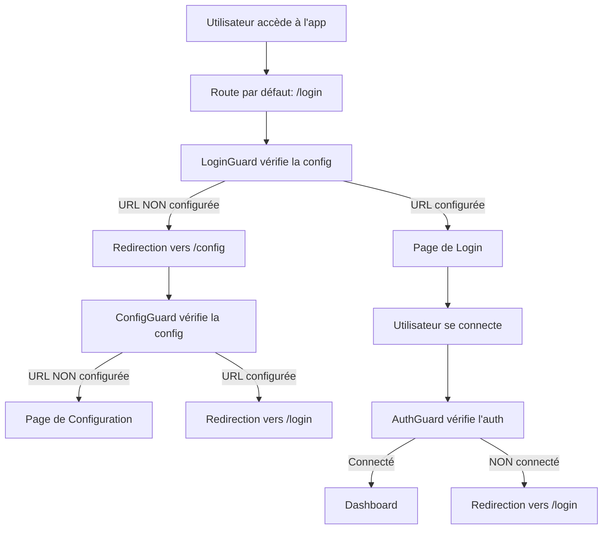

# Flux de Navigation NewDoli

## 🔄 Comportement de Redirection Automatique

L'application NewDoli utilise un système de guards intelligents pour rediriger automatiquement les utilisateurs vers la page appropriée selon l'état de la configuration.

### 📋 Guards Implémentés

#### 1. **ConfigGuard** 
- **Utilisé sur** : `/config`
- **Comportement** : 
  - ✅ Si URL Dolibarr **NON configurée** → Autorise l'accès à la page de configuration
  - ❌ Si URL Dolibarr **configurée** → Redirige vers `/login`

#### 2. **LoginGuard**
- **Utilisé sur** : `/login`
- **Comportement** :
  - ✅ Si URL Dolibarr **configurée** → Autorise l'accès à la page de login
  - ❌ Si URL Dolibarr **NON configurée** → Redirige vers `/config`

#### 3. **AuthGuard**
- **Utilisé sur** : Toutes les pages protégées
- **Comportement** :
  - ✅ Si utilisateur **connecté** → Autorise l'accès
  - ❌ Si utilisateur **NON connecté** → Redirige vers `/login`

### 🔄 Flux de Navigation



### 🎯 Scénarios d'Utilisation

#### **Premier Accès (URL non configurée)**
1. Utilisateur accède à `http://localhost:4200`
2. Redirection vers `/login`
3. `LoginGuard` détecte qu'aucune URL n'est configurée
4. Redirection automatique vers `/config`
5. Utilisateur configure l'URL Dolibarr
6. Après sauvegarde → Redirection vers `/login`

#### **Accès Ultérieur (URL configurée)**
1. Utilisateur accède à `http://localhost:4200`
2. Redirection vers `/login`
3. `LoginGuard` détecte que l'URL est configurée
4. Affichage de la page de login
5. Utilisateur se connecte
6. Redirection vers le dashboard

#### **Tentative d'Accès à /config (URL déjà configurée)**
1. Utilisateur accède directement à `/config`
2. `ConfigGuard` détecte que l'URL est déjà configurée
3. Redirection automatique vers `/login`
4. Utilisateur peut se connecter normalement

### 🔧 Configuration des Routes

```typescript
export const routes: Routes = [
  {
    path: '',
    redirectTo: '/login',  // Redirection par défaut
    pathMatch: 'full'
  },
  {
    path: 'config',
    loadComponent: () => import('./pages/config/config.component').then(m => m.ConfigComponent),
    canActivate: [ConfigGuard]  // Vérifie si URL configurée
  },
  {
    path: 'login',
    loadComponent: () => import('./pages/login/login.component').then(m => m.LoginComponent),
    canActivate: [LoginGuard]  // Vérifie si URL configurée
  },
  {
    path: 'dashboard',
    loadComponent: () => import('./pages/dashboard/dashboard.component').then(m => m.DashboardComponent),
    canActivate: [ConfigGuard, AuthGuard]  // Vérifie config ET auth
  }
  // ... autres routes
];
```

### ✅ Avantages du Système

1. **Navigation Intuitive** : L'utilisateur est toujours dirigé vers la bonne page
2. **Prévention des Erreurs** : Impossible d'accéder à la config si déjà configurée
3. **Expérience Fluide** : Redirections automatiques et transparentes
4. **Sécurité** : Vérification de la configuration avant l'authentification
5. **Maintenance** : Logique centralisée dans les guards

### 🔍 Validation des URLs

Les guards valident que l'URL Dolibarr est :
- ✅ **Présente** dans la base de données
- ✅ **Valide** (format HTTP/HTTPS)
- ✅ **Accessible** (vérification de format)

```typescript
private isValidUrl(url: string): boolean {
  try {
    const urlObj = new URL(url);
    return urlObj.protocol === 'http:' || urlObj.protocol === 'https:';
  } catch {
    return false;
  }
}
```

### 🚀 Résultat

L'utilisateur a maintenant une expérience fluide :
- **Premier accès** → Configuration → Login → Dashboard
- **Accès ultérieurs** → Login → Dashboard
- **Tentative d'accès à config** → Redirection automatique vers login

Le système de navigation NewDoli est maintenant parfaitement optimisé ! 🎉
